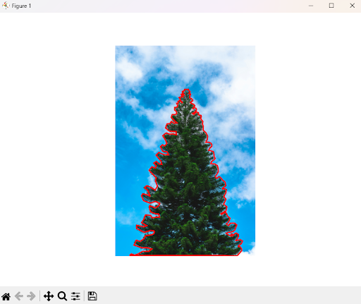

# Лесотаксация 

Традиционные методы лесотаксации, основанные на наземных обследованиях, требуют значительных временных и трудовых затрат, особенно на крупных и труднодоступных территориях. Использование беспилотных летательных аппаратов (самолетного/мультироторного типа) позволяет значительно повысить эффективность сбора данных о состоянии лесных массивов. Ключевым этапом обработки данных, полученных с БПЛА, является сегментация изображений, направленная на выделение отдельных деревьев и их крон для дальнейшего анализа.
Большинство существующих наборов данных, хоть и имеют допустимую разметку, но не подходят для решения задачи лесотаксации, так как обладают низким разрешением кадров, а также каждый снимок выполнен в одной плоскости. 

В рамках данного проекта необходимо было сформировать датасет подходящих изображений, а именно с разрешением не менее 512x512 пикселей, после чего каждое из изображений аннотировать - выделить области, относящиеся к классу «деревья». 

На основе выделенных крон в последующем будет проводиться анализ таксационных параметров, таких как плотность леса, размеры и сомкнутость крон, высота деревьев и объем стволов. Перечисленные данные необходимы для оценки состояния лесных массивов. 

Пример изображений, подходящих под требования проекта: [media](media)

Результат аннотации: [COCO](result.json)

# Данные кернов - обработка больших изображений

 В рамках данного проекта необходимо было провести research - исследование для определения вариантов решения задачи обработки моделями глубоких нейронных сетей фотографий с большим размером файла (порядка 100 мб). 

 Основная проблема заключается в том, что современные нейронные сети не способны обрабатывать фотографии столь высоких размеров, поэтому существуют варианты комбинирования подходов обработки изображений. Об этом подробнее в [отчете](research.pdf).

 # Конференции, стипендии, гранты

  - Проект по обработке снимков, полученных с БПЛА для лесотаксации был представлен на [XIV Конгрессе молодых ученых ИТМО](https://kmu.itmo.ru/ru):
  
    - [сертификат](certificate.pdf);
    - [тезис](kmu-2025-tezis.pdf).
  
  - Была подана заявка на конкурс грантов КНВШ для студентов и аспирантов в секции автоматика, телемеханика с проектом лесотаксации.
